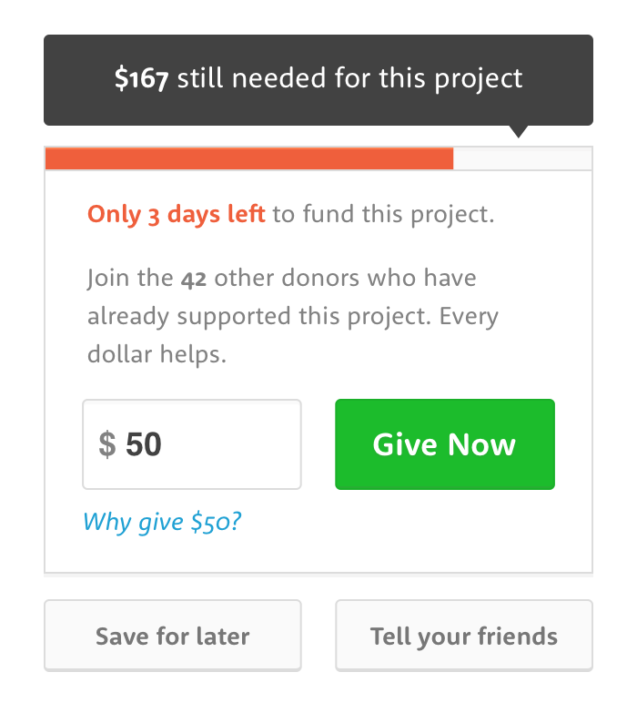

This repository is created for a web development take home assignment as a selection process for a reputed company.

I was given below design of a component in form of png image which needs to be broght to life using HTML, CSS and JavaScript.

The output can be viewed [here](https://hirengondhiya.github.io/abco-take-homeassignment/)

I have used following

- SASS: Pre-processor for CSS.
- Parcel: For building source and bundling assets.
- prettier: Linter for code style consistency.
- lint-staged: To automatically use pretter before the code is committed.
- node-sass: NPM package for processing SASS files.
